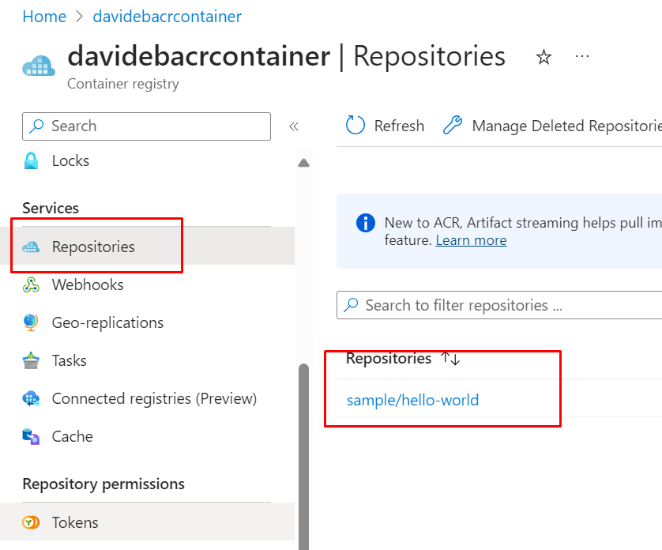

This page lists some scripts useful for working with [[Azure Container Registry]].

## Create ACR

```bash
az acr create
  --resource-group <resourceGroup>
  --name <myContainerRegistry>
  --sku Basic
```

Resource Group, Name, and Sku are **mandatory**.

Note:

- `name` must be lowercase, between 5 and 50 chars
- `sku`: Basic, Premium, Standard.

It returns the whole structure

```json
{
  "adminUserEnabled": false,
  "anonymousPullEnabled": false,
  "creationDate": "2024-04-02T12:23:11.162737+00:00",
  "dataEndpointEnabled": false,
  "dataEndpointHostNames": [],
  "encryption": {
    "keyVaultProperties": null,
    "status": "disabled"
  },
  "id": "/subscriptions/9d91e956-idsubscription-309a15956a53/resourceGroups/az204-rg/providers/Microsoft.ContainerRegistry/registries/davidebacrcontainer",
  "identity": null,
  "location": "westeurope",
  "loginServer": "davidebacrcontainer.azurecr.io",
  "metadataSearch": "Disabled",
  "name": "davidebacrcontainer",
  "networkRuleBypassOptions": "AzureServices",
  "networkRuleSet": null,
  "policies": {
    "azureAdAuthenticationAsArmPolicy": {
      "status": "enabled"
    },
    "exportPolicy": {
      "status": "enabled"
    },
    "quarantinePolicy": {
      "status": "disabled"
    },
    "retentionPolicy": {
      "days": 7,
      "lastUpdatedTime": "2024-04-02T12:23:18.027167+00:00",
      "status": "disabled"
    },
    "softDeletePolicy": {
      "lastUpdatedTime": "2024-04-02T12:23:18.027203+00:00",
      "retentionDays": 7,
      "status": "disabled"
    },
    "trustPolicy": {
      "status": "disabled",
      "type": "Notary"
    }
  },
  "privateEndpointConnections": [],
  "provisioningState": "Succeeded",
  "publicNetworkAccess": "Enabled",
  "resourceGroup": "az204-rg",
  "sku": {
    "name": "Basic",
    "tier": "Basic"
  },
  "status": null,
  "systemData": {
    "createdAt": "2024-04-02T12:23:11.162737+00:00",
    "createdBy": "d.bel@aaaaa.com",
    "createdByType": "User",
    "lastModifiedAt": "2024-04-02T12:23:11.162737+00:00",
    "lastModifiedBy": "d.bel@aaaaa.com",
    "lastModifiedByType": "User"
  },
  "tags": {},
  "type": "Microsoft.ContainerRegistry/registries",
  "zoneRedundancy": "Disabled"
}
```

## Create and push a Docker image

This command reads the content of the Dockerfile, creates an image named _sample/hello-world:v1_, and pushes it to the Registry.

```bash
az acr build
  --image sample/hello-world:v1
  --registry <myContainerRegistry>
  --file Dockerfile
  .
```

You can find the result in the UI:



## Show all images under a repository

To show the names of all the images stored in a ACR, you have to use:

```bash
az acr repository list
  --name <nome-registry>
  --output table
```

## Show all tags for an image

```bash
az acr repository show-tags
  --name <myContainerRegistry>
  --repository sample/hello-world
  --output table
```

## Run a container given its image

```bash
az acr run
  --registry <myContainerRegistry>
  --cmd '$Registry/sample/hello-world:v1'
  /dev/null
```

The `cmd` parameter in this example runs the container in its default configuration, but cmd supports other `docker run` parameters or even other docker commands.

Queue a run to execute a container command:

```bash
az acr run -r myregistry --cmd '$Registry/myimage' /dev/null
```

Queue a run with the task definition from the standard input. Either 'Ctrl + Z'(Windows) or
'Ctrl + D'(Linux) terminates the input stream:

```bash
az acr run -r myregistry -f - /dev/null
```

Queue a run to execute the tasks passed through the pipe:

```bash
cat task.yaml | az acr run -r myregistry -f - /dev/null
```

Queue a local context, pushed to ACR with streaming logs:

```bash
az acr run -r myregistry -f bash-echo.yaml ./workspace
```

Queue a remote git context with streaming logs:

```bash
az acr run -r myregistry https://github.com/Azure-Samples/acr-tasks.git -f hello-world.yaml
```

Queue a remote git context with streaming logs and runs the task on Linux platform:

```bash
az acr run -r myregistry https://github.com/Azure-Samples/acr-tasks.git -f build-hello-
        world.yaml --platform linux
```

Queue a remote OCI Artifact context and runs the task:

```bash
az acr run -r myregistry oci://myregistry.azurecr.io/myartifact:mytag -f hello-world.yaml
```
