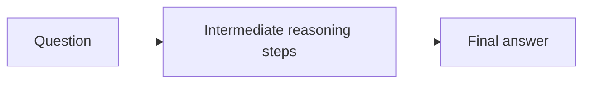

**Chain-of-thought (CoT) prompting** is a prompt-engineering technique that encourages a language model to produce intermediate reasoning steps before giving a final answer.

Instead of requesting only the answer, the prompt asks the model to work through the problem step by step. This often improves performance on tasks that require arithmetic, symbolic reasoning, commonsense reasoning, or multistep decision-making.

## Summary

- CoT prompting asks the model to expose **intermediate reasoning steps**.
- It is most useful on tasks where the answer depends on **multiple logical steps**.
- CoT can be given through **few-shot examples** or through direct step-by-step instructions.
- It often improves benchmark performance, but it also increases token usage and latency.
- Variants such as [[CoT@32]] combine CoT with repeated sampling and voting.

## Why It Helps

Many tasks are difficult because the model must perform hidden intermediate work:

- decompose the problem
- keep track of partial results
- apply rules in order
- avoid jumping too early to a final answer

CoT prompting externalizes some of that process in text. For sufficiently capable models, this can make the reasoning path more reliable.

## Common Forms

### Few-Shot CoT

The prompt includes worked examples that show both:

- the question
- the reasoning steps
- the final answer

This teaches the model the expected reasoning pattern through demonstration.

### Zero-Shot CoT

The prompt gives a direct instruction such as asking the model to think step by step, even without examples.

### Self-Consistency Variants

Instead of taking one CoT sample, the system samples multiple reasoning traces and selects the most consistent final answer. See [[CoT@32]].

## Typical Pattern

This does not guarantee correctness; it only changes how the model is prompted to allocate its reasoning process.

## Where It Works Well

- arithmetic word problems
- symbolic reasoning
- commonsense reasoning
- multistep question answering
- benchmark settings such as [[MMLU]]

## Limitations

- CoT can produce plausible but incorrect reasoning.
- Smaller or weaker models may not benefit much from it.
- Revealed reasoning is not always a faithful explanation of the internal process.
- It increases token usage, latency, and sometimes prompt brittleness.
- In production systems, exposing full reasoning traces may be undesirable for privacy, safety, or UX reasons.

## Practical Notes

- Use CoT when the task truly requires several steps; it can be unnecessary overhead for simple retrieval or classification.
- Benchmark gains from CoT should be compared carefully with non-CoT baselines because token budget changes.
- CoT is a prompting technique, not the same thing as model training or architectural change.

## Related

- [[CoT@32]]
- [[MMLU]]
- [[Hyperparameters]]

## Sources

- [Chain-of-Thought Prompting Elicits Reasoning in Large Language Models](https://arxiv.org/abs/2201.11903)
- [Large Language Models are Zero-Shot Reasoners](https://arxiv.org/abs/2205.11916)
