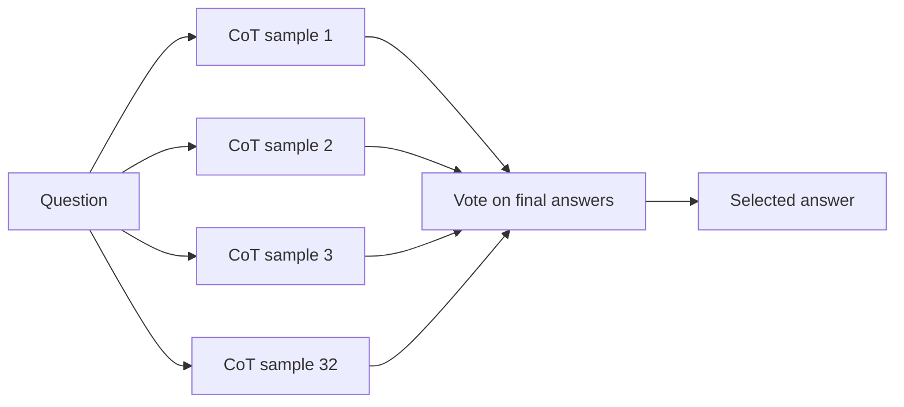

**CoT@32** usually means evaluating a model with **chain-of-thought prompting** across **32 sampled reasoning runs** for the same question, then aggregating the answers—most commonly with **majority voting**.

It is a shorthand often seen in benchmark tables for reasoning tasks. Instead of asking the model once, the evaluator asks it multiple times, lets it produce multiple reasoning traces, and uses the final answers to estimate whether repeated reasoning improves accuracy.

## Summary

- **CoT** stands for [[Chain of Thought Prompting]].
- The **@32** means the model is sampled **32 times** per question.
- The final prediction is usually chosen by **majority vote** over the 32 final answers.
- CoT@32 is associated with **self-consistency** style evaluation: different reasoning paths may converge on the same correct answer.
- It improves benchmark scores by spending more inference budget, so it is not directly comparable to a single-sample prompt.

## Why Use CoT@32

A single reasoning sample can fail because the model follows one unlucky or inconsistent path. Sampling multiple reasoning traces gives the system multiple chances to reach the correct conclusion.

If several independent runs arrive at the same final answer, that answer is often more reliable than the result of one sample alone.

## Typical Workflow

The important point is that the vote is usually taken over the **final answers**, not over every token in the reasoning trace.

## Relationship to Self-Consistency

CoT@32 is a practical form of **self-consistency decoding**:

- generate multiple reasoning paths
- keep temperature or sampling enabled
- aggregate the resulting answers

The idea is that correct reasoning may be more **stable across samples** than incorrect reasoning.

## Trade-offs

| Benefit                                                               | Cost                                             |
| --------------------------------------------------------------------- | ------------------------------------------------ |
| Higher reasoning accuracy on many benchmarks                          | Roughly 32x more inference calls than one sample |
| Less dependence on one brittle reasoning trace                        | Higher latency                                   |
| Better benchmark performance on tasks like [[MMLU]] or math reasoning | Higher token and compute cost                    |

Because of this, CoT@32 is best understood as an **evaluation or high-budget inference setting**, not a default production configuration.

## Limitations

- It can improve the answer without making the model fundamentally more capable.
- It increases cost and latency substantially.
- Majority vote can still reinforce a common wrong answer if the model's errors are correlated.
- Reported CoT@32 scores should not be compared casually with greedy or single-sample results.

## Related

- [[Chain of Thought Prompting]]
- [[MMLU]]
- [[Inference Optimization]]

## Sources

- [Chain-of-Thought Prompting Elicits Reasoning in Large Language Models](https://arxiv.org/abs/2201.11903)
- [Self-Consistency Improves Chain of Thought Reasoning in Language Models](https://arxiv.org/abs/2203.11171)
