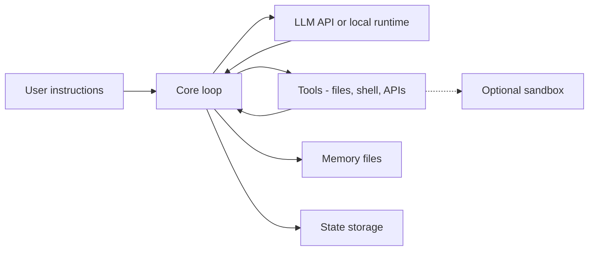

**Harness engineering** is the practice of building and operating the **harness** around a rented or hosted **LLM**: rules, orchestration, tools, memory, and integration that steer the model toward useful work. You do not own the model weights; you own how the system calls the model, persists state, and executes deterministic steps. A harness is more than a short prompt or context engineering alone—it is engineered structure (skills, scripts, services) that makes agent behavior less dependent on any single model release.

## Summary

- LLMs are **non-deterministic**, bounded by training data, and **expensive at inference**; harness engineering does not fix slop or unpredictability but is currently the best lever to make outputs **less wrong**.
- Reported **10–30% productivity gains** depend on surrounding engineering excellence (testing, CI/CD, automation, observability), not on the harness alone.
- A **harness** implements a complex **AI agent**: instructions plus code, orchestration, tool integration, and optional determinism when the harness invokes tools (the model itself stays probabilistic).
- A **2–10 line prompt is not a harness**; meaningful harnesses need rules, structure, design, and often explicit architecture.
- **Skills** (markdown instruction files) are a minimal harness form, reusable across hosts (e.g. Claude Code, Codex, OpenCode); harnesses can grow into full programs (Rust, Java, Scala, etc.).
- Popular **coding harnesses** include Claude Code and Codex; many teams build custom harnesses to steer models with proprietary rules and scripts.
- Typical **anatomy**: remote or local LLM (not embedded), core orchestration loop, **tools** (file/shell operations via real code), **memory** (often markdown files), **state storage**, optional **sandbox**.
- Useful **patterns** include progressive disclosure, advisor (plan vs execute with smaller models), and an **escape hatch** so the agent can defer or offer alternatives instead of blindly complying.
- Closed-source harnesses are harder to debug; **token usage** and growing monolith complexity are ongoing risks.

## What is a harness?

An **AI agent** can be described as instructions to achieve a task. As those instructions grow—and especially when they include executable code—you have a **harness**: how complex agents are implemented in practice.

Compared with a bare prompt:

| Level | What it is |
| ----- | ---------- |
| Short prompt | Not a harness (author cites roughly 2–10 lines as insufficient). |
| Context engineering | Managing the context window; necessary but not sufficient for a harness. |
| Harness | Orchestration, integration, engineering around tool calls, and structure (skills, scripts, services, architecture). |

**Determinism** in this sense means: when the harness runs a tool, script, or API call, that step is ordinary software and behaves predictably. The **LLM’s text output** remains non-deterministic; the harness bridges probabilistic planning with deterministic execution.

## Harness anatomy

### LLM

The model is **not embedded** inside the harness binary. The harness calls a **remote API** or a **local runtime** (e.g. [[Ollama]] on the machine). The harness orchestrates; the model **generates and reasons in text**—it does not directly “run” file or shell operations.

### Core loop

The harness is an **orchestration machine**: read user instructions, call the LLM, facilitate **tool calls**, parse outputs, format payloads for the next turn, and repeat. This loop is where integration and control live.

### Tools

Harnesses expose **tools**—commonly bash-oriented capabilities (create/read files, run scripts). Because LLMs emit text, not compiled programs, **real code** in the harness must create files on disk, execute commands, and return stdout/stderr (or structured results) back to the model. Tool invocation is the main place **engineering determinism** shows up.

### Memory

Harnesses persist context in **plain files** (`.txt`, `.md`)—for example project rules in `AGENTS.md` or host-specific memory files. Memory can be **short-term** (session) or **long-term**; **RAG** and **vector databases** are forms of long-term memory the harness may use. At scale, [[RAG Pipeline Caching]] (semantic, retrieval, and prompt layers) reduces latency and inference cost for RAG-backed harnesses.

### State storage

Beyond conversational memory, harnesses may write **JSON or other artifacts** to the filesystem for subagents, checkpoints, or workflow state. Some designs add a virtual filesystem backed by relational or NoSQL stores.

### Sandbox (optional)

Running tool execution inside a **sandbox** adds layered security. Many coding harnesses rely on third-party gateways or sandboxes rather than implementing strong isolation themselves.

## Patterns

| Pattern | Idea |
| ------- | ---- |
| **Progressive disclosure** | Give the model a **pointer** (e.g. “read `linter-js.md`”) instead of loading all skills and docs up front; load on demand to manage the context window. |
| **Advisor** | Separate **decision/planning** from **execution**—e.g. a smaller model gathers options, a larger model aggregates into a plan (also helps context limits). |
| **Escape hatch** | LLMs tend to comply even when the request is wrong; design flows where the agent can **stop, ask, or offer choices** (e.g. accept an automated code review vs write your own). |

The author maintains a growing catalog of harness patterns (46+ at time of writing); the article links to it from the post body.

## Implementation spectrum

- **Skills**: Markdown files with procedures, portable across multiple harness hosts.
- **Scripts on demand**: Pre-built scripts the LLM is instructed to call.
- **Full harness programs**: Orchestrators in Rust, Java, Scala, etc.; many popular harnesses today use TypeScript and terminal UI stacks—the author argues Rust is a strong fit for harness implementations.

## Limits and operational reality

- No harness is **100% slop-proof** while it still depends on an LLM at the core.
- **Poor execution** (weak review, weak CI, weak observability) produces “slop disasters” even in large organizations.
- **Closed-source** harnesses are harder to inspect, debug, and reason about as they grow into monoliths.
- Engineers increasingly **drive the harness** (review output, refine rules); AI is a **tool**, not a genie that ships a perfect system in one shot.
- **Token usage** can grow quickly; maximizing context without need is wasteful.

## Related

- [[Model Context Protocol]] — standardized way for AI hosts to discover and invoke external tools (complements harness tool layers).
- [[Ollama]] — local LLM runtime harnesses may call instead of a remote API.
- [[PII redaction before LLM prompts]] — gateway-style controls before text reaches an external model.
- [[Connect Cursor to Azure DevOps for AI code reviews]] — example of giving a coding agent structured tool access via MCP.

## Sources

- [Diego Pacheco — “Harness Engineering”](https://diego-pacheco.blogspot.com/2026/05/harness-engineering.html) — definition, anatomy, patterns, productivity and slop framing (May 2026).
