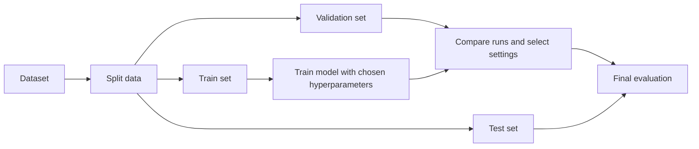

Hyperparameters are configuration choices set **before or during training** that influence how a machine-learning model learns, how complex it can become, and how well it generalizes to unseen data.

They are not learned directly from the training data. Instead, they control the training process or the model structure, while the model's [[Parameters|parameters]] (such as weights and biases) are learned by optimization.

## Summary

- [[Parameters|Parameters]] are learned from data; **hyperparameters** are chosen by the practitioner or tuning process.
- Hyperparameters affect training speed, stability, model capacity, and generalization.
- Poor hyperparameter choices can cause **underfitting**, **overfitting**, slow convergence, or unstable training.
- Hyperparameters are typically selected using a **validation set** or cross-validation, not the final test set.
- Common tuning approaches include manual tuning, grid search, random search, and Bayesian optimization.

## Parameters vs Hyperparameters

| Aspect                          | Parameters                 | Hyperparameters                                              |
| ------------------------------- | -------------------------- | ------------------------------------------------------------ | -------------------------------------------------------------------- |
| How they are obtained           | Learned during training    | Set before or adjusted across training runs                  |
| Examples                        | [[Model Weights            | Weights]], biases, tree split values                         | Learning rate, batch size, number of layers, regularization strength |
| Role                            | Encode patterns from data  | Control the training process or model capacity               |
| Changes within one training run | Usually updated many times | Usually fixed for that run, though some can follow schedules |

## Common Hyperparameters

| Hyperparameter                   | What it controls                          | Typical effect if too low          | Typical effect if too high                      |
| -------------------------------- | ----------------------------------------- | ---------------------------------- | ----------------------------------------------- |
| **Learning rate**                | Step size of each optimization update     | Training can be very slow          | Training can diverge or oscillate               |
| **Batch size**                   | Number of examples per update             | Noisy gradients, slower throughput | High memory usage, weaker regularization effect |
| **[[Epochs|Number of epochs]]** | How long training continues               | Underfitting                       | Overfitting                                     |
| **Model size / depth**           | Representational capacity                 | Model may be too simple            | Model may memorize noise or become expensive    |
| **Regularization strength**      | Penalty on overly complex solutions       | Overfitting risk increases         | Model may underfit                              |
| **Dropout rate**                 | Fraction of units dropped during training | Less regularization                | Training signal can become too weak             |
| **Weight decay**                 | Shrinks large weights                     | Weights may grow too freely        | Model may become too constrained                |
| **Number of trees / tree depth** | Capacity in ensemble/tree models          | Weak predictive power              | Higher variance and cost                        |

The exact set of hyperparameters depends on the algorithm:

- **Linear models:** regularization strength
- **Decision trees / forests:** tree depth, minimum samples per split, number of trees
- **Gradient boosting:** learning rate, tree depth, number of estimators
- **Neural networks:** learning rate, batch size, optimizer, number of layers, hidden size, dropout

## Why Hyperparameters Matter

Hyperparameters define important trade-offs:

- **Bias vs variance:** simpler settings may underfit, while more flexible settings may overfit.
- **Speed vs quality:** aggressive settings can shorten training time but reduce stability or final quality.
- **Accuracy vs cost:** larger models or broader searches may improve results but require more compute and memory.

Because of these trade-offs, hyperparameter tuning is a core part of model development rather than a minor cleanup step.

Some hyperparameters, such as layer count, hidden size, or sequence length, also influence serving cost later in production. See [[Inference Optimization]].

## How Tuning Usually Works

Hyperparameters should be chosen against a validation process:

Key idea:

- Use the **training set** to fit model parameters.
- Use the **validation set** to compare hyperparameter choices.
- Use the **test set** only for final evaluation after tuning decisions are complete.

## Common Tuning Strategies

### Manual Tuning

Useful when you already understand the model family and want quick feedback. It is simple but can miss better regions of the search space.

### Grid Search

Tests every combination from a predefined set of candidate values. It is easy to reason about but becomes expensive as the number of hyperparameters grows.

### Random Search

Samples combinations at random from predefined ranges or distributions. It often finds strong settings more efficiently than grid search when only a few hyperparameters dominate performance.

### Bayesian Optimization

Uses results from earlier trials to choose more promising next trials. It is useful when each training run is expensive.

## Practical Notes

- Tune the hyperparameters that matter most first, such as learning rate, regularization, and model capacity.
- Change one assumption at a time when exploring manually so that comparisons stay meaningful.
- Keep metrics, seeds, and dataset splits consistent across experiments.
- Prefer ranges on a **log scale** for values like learning rate or regularization strength.
- Retuning may be necessary when the dataset, features, architecture, or objective changes.

## Limitations

- Better validation performance on one dataset split does not guarantee better real-world performance.
- Repeated tuning against the same validation set can indirectly overfit to that validation process.
- Exhaustive search can be computationally expensive and environmentally costly for large models.
- Good defaults differ by model family, dataset size, feature quality, and optimization method.

## Related

- [[Supervised vs Self-Supervised Learning]]
- [[Parameters]]
- [[Inference Optimization]]
- [[Responsible AI]]
- [[Epochs]]

## Sources

- [Google for Developers - Hyperparameter tuning](https://developers.google.com/machine-learning/crash-course/overfitting/hyperparameter-tuning)
- [Bergstra and Bengio - Random Search for Hyper-Parameter Optimization](https://jmlr.org/beta/papers/v13/bergstra12a.html)
- [Snoek et al. - Practical Bayesian Optimization of Machine Learning Algorithms](https://papers.nips.cc/paper_files/paper/2012/hash/05311655a15b75fab86956663e1819cd-Abstract.html)
