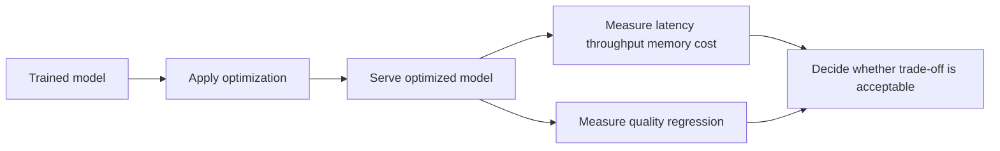

**Inference optimization** is the practice of making a trained model run faster, cheaper, or with lower memory use at prediction time while preserving acceptable output quality.

Unlike training optimization, inference optimization focuses on the deployed path that serves predictions to users or downstream systems. It works with already learned [[Parameters|parameters]] and may also depend on deployment-time choices that are separate from training [[Hyperparameters|hyperparameters]].

## Summary

- Inference optimization targets **latency**, **throughput**, **memory usage**, **cost**, and sometimes **energy consumption**.
- Common techniques include quantization, pruning, distillation, batching, compilation, caching, and hardware-aware execution.
- Better inference performance usually trades off against model quality, flexibility, portability, or engineering complexity.
- Some optimizations change the model artifact itself, while others change only the serving pipeline.

## Why It Matters

Inference is the part users experience directly. Even a strong model can be impractical in production if it is too slow, too expensive, or too memory-heavy to serve at scale.

Common goals include:

- reducing end-user latency
- increasing requests per second
- fitting the model into limited GPU, CPU, or edge-device memory
- lowering infrastructure and token costs
- improving battery or power efficiency on client devices

## Common Techniques

| Technique                            | Main idea                                                        | Typical benefit                       | Typical trade-off                      |
| ------------------------------------ | ---------------------------------------------------------------- | ------------------------------------- | -------------------------------------- |
| **Quantization**                     | Represent weights or activations with lower precision            | Lower memory use and faster execution | Possible quality loss                  |
| **Pruning**                          | Remove less important weights, channels, or blocks               | Smaller and sometimes faster model    | Accuracy can degrade if too aggressive |
| **Distillation**                     | Train a smaller student model from a larger teacher              | Better speed-cost profile             | Student may lose capability            |
| **Batching**                         | Process several requests together                                | Higher throughput                     | Individual request latency may rise    |
| **Compilation / graph optimization** | Fuse operations or optimize execution for a backend              | Faster runtime                        | Platform-specific complexity           |
| **Caching**                          | Reuse repeated work or outputs                                   | Lower latency and cost                | Cache invalidation and hit-rate limits |
| **Speculative or assisted decoding** | Use a smaller helper model or heuristic to accelerate generation | Faster token generation               | More serving complexity                |

## Model-Level vs System-Level Optimization

Some inference optimizations modify the model or its learned representation:

- quantization
- pruning
- distillation
- low-rank adaptations merged for serving

Others optimize the surrounding system:

- request batching
- prompt or response caching
- better hardware placement
- optimized runtimes such as ONNX Runtime, TensorRT, or vLLM

This distinction matters because model-level techniques usually affect the deployed artifact, while system-level techniques often preserve the model but change how it is executed.

## Relationship to Parameters and Hyperparameters

- [[Parameters|Parameters]] are the learned values used during inference; many optimization techniques compress, reorganize, or execute those values more efficiently.
- [[Hyperparameters|Hyperparameters]] mostly govern training, but they can indirectly affect inference cost by influencing model size, layer count, hidden dimension, or sequence length.

Inference optimization also introduces serving-time configuration choices, such as batch size limits, cache policies, and precision modes. These are operational settings, not the same thing as training hyperparameters.

## Typical Evaluation Workflow

A useful optimization should be judged on both:

- **serving metrics** such as latency, throughput, and memory
- **quality metrics** such as accuracy, BLEU, perplexity, win rate, or task success

## Practical Notes

- The best optimization depends on whether the bottleneck is compute, memory bandwidth, context length, or network overhead.
- LLM inference often adds decoding-specific concerns such as KV-cache memory, prompt reuse, and token generation speed.
- Edge devices favor compact models and low power use, while backend services often optimize for throughput and fleet cost.
- Some optimizations stack well together, such as quantization plus compiled runtimes plus batching.

## Related

- [[Parameters]]
- [[Hyperparameters]]
- [[RAG Pipeline Caching]]

## Sources

- [NVIDIA TensorRT Documentation](https://docs.nvidia.com/deeplearning/tensorrt/)
- [ONNX Runtime Performance Tuning](https://onnxruntime.ai/docs/performance/)
- [Hugging Face - LLM Inference Optimization](https://huggingface.co/docs/transformers/main/en/llm_optims)
