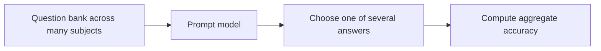

**MMLU** stands for **Massive Multitask Language Understanding**, a benchmark used to evaluate how well language models perform across a wide range of knowledge and reasoning tasks.

It is widely used in LLM evaluation because it spans many subjects rather than focusing on one narrow skill.

## Summary

- MMLU is a **multiple-choice benchmark** covering many academic and professional subjects.
- It is used to estimate broad model capability in knowledge recall and reasoning.
- Subjects range from mathematics and computer science to history, law, and medicine.
- Scores are often reported with different prompting settings, including [[Chain of Thought Prompting]] and [[CoT@32]].
- A higher MMLU score does not automatically mean better real-world performance on every task.

## What MMLU Measures

MMLU asks questions across dozens of domains intended to reflect undergraduate-level, graduate-level, and professional knowledge.

It is useful for checking whether a model can:

- recall factual knowledge
- apply domain-specific concepts
- reason through multiple-choice answers
- generalize across many subjects

## Why It Became Popular

MMLU became a common headline benchmark because it offers:

- broad coverage across many disciplines
- a relatively simple evaluation format
- easy comparison across model families and prompting styles

As a result, many model cards, blog posts, and research papers report MMLU scores.

## Typical Evaluation Setup

Depending on the paper, the model may answer:

- directly
- with few-shot prompting
- with [[Chain of Thought Prompting]]
- with repeated reasoning and voting such as [[CoT@32]]

## How to Read MMLU Scores

When comparing results, check:

- whether the setup is zero-shot or few-shot
- whether chain-of-thought prompting was used
- whether repeated sampling or self-consistency was used
- whether the result is average accuracy across all subjects

These details matter because the same model can post meaningfully different scores under different evaluation protocols.

## Limitations

- Multiple-choice format can reward elimination strategies rather than deep understanding.
- Broad benchmark coverage does not guarantee usefulness on a specific application.
- High scores may reflect benchmark familiarity or contamination risk.
- MMLU is mostly an evaluation benchmark, not a full picture of safety, robustness, grounding, or tool use.

## Related

- [[Chain of Thought Prompting]]
- [[CoT@32]]
- [[Responsible AI]]

## Sources

- [Measuring Massive Multitask Language Understanding](https://arxiv.org/abs/2009.03300)
- [Holistic Evaluation of Language Models](https://crfm.stanford.edu/helm/latest/)
