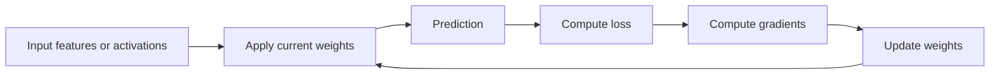

**Model weights** are learned numerical values that determine how strongly one input, feature, or neuron influences the model's output. In many machine-learning models, weights are a major subset of the model's learned [[Parameters|parameters]].

Weights are adjusted during training so that the model reduces its loss on the training objective. Their final values encode part of what the model has learned from data.

## Summary

- Weights are learned values that scale the influence of inputs or internal activations.
- In neural networks, weights connect neurons across layers.
- Weights are usually updated by an optimizer through gradient-based learning.
- Large or poorly controlled weights can contribute to instability or overfitting.
- Weights are parameters, not hyperparameters.

## What Weights Do

At a high level, a weight tells the model how much importance to assign to a signal.

Examples:

- In **linear regression**, each feature has a weight that scales its contribution to the prediction.
- In **logistic regression**, weights influence the score that is later converted into a probability.
- In a **neural network**, weights determine how activations from one layer contribute to the next layer.
- In an **attention mechanism**, learned weight matrices transform token representations before attention is computed.

If a weight changes, the model's predictions can change as well.

## Weights and Biases

Weights are often discussed together with **biases**:

- **Weights** scale or transform an incoming signal.
- **Biases** shift the result before the activation or final output step.

Together, weights and biases let the model represent a wide range of functions. See [[Parameters]] for the broader concept.

## How Weights Are Learned

During training, the model starts with initial weights and updates them repeatedly:

For many modern models, backpropagation computes gradients and an optimizer uses them to update the weights.

## Why Weights Matter

- They directly affect the model's outputs.
- Their scale and distribution can influence optimization stability.
- Very large weights can make a model sensitive to small input changes.
- Weight values affect generalization and can reflect overfitting when the model becomes too specialized to the training data.

Techniques such as regularization, weight decay, normalization, and careful initialization are often used to keep weight learning stable. Many of these controls are configured through [[Hyperparameters]].

## Weights vs Parameters vs Hyperparameters

| Concept             | Meaning                                                        | Examples                                                                   |
| ------------------- | -------------------------------------------------------------- | -------------------------------------------------------------------------- |
| **Weights**         | Learned values that scale or transform signals                 | Regression coefficients, neural-network connection values, weight matrices |
| **Parameters**      | All learned internal model values                              | Weights, biases, embeddings, split thresholds                              |
| **Hyperparameters** | Configuration choices that control training or model structure | Learning rate, batch size, number of layers, regularization strength       |

So:

- All weights are parameters.
- Not all parameters are weights.
- Weights are not hyperparameters.

## Practical Notes

- The phrase **model weights** is often used informally to refer to the saved learned state of a model, especially for neural networks.
- A checkpoint file may contain weights together with biases, optimizer state, and other training metadata.
- Fine-tuning starts from existing pretrained weights and updates them on new data.
- Large language models are often described by parameter count, but much of that count comes from learned weight tensors.

## Related

- [[Parameters]]
- [[Hyperparameters]]
- [[Supervised vs Self-Supervised Learning]]

## Sources

- [Google for Developers - Linear regression](https://developers.google.com/machine-learning/crash-course/linear-regression)
- [DeepLearning.AI - Weights and Biases](https://www.deeplearning.ai/resources/glossary/weight/)
