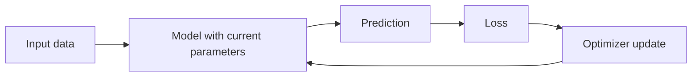

In machine learning, **parameters** are the internal values a model learns from data during training. They store the patterns the model has discovered and are used later to make predictions on new inputs.

Unlike [[Hyperparameters]], parameters are not chosen manually for a training run. They are updated automatically by the learning algorithm to reduce a loss function.

## Summary

- Parameters are the model values learned from data during training.
- They directly determine the model's predictions after training.
- Different model families store parameters in different forms, such as weights, biases, or split values.
- [[Model Weights|Weights]] are one important kind of parameter, especially in linear models and neural networks.
- Training adjusts parameters to reduce error on the training objective.
- Hyperparameters control how learning happens; parameters are the result of that learning.

## What Parameters Do

Parameters encode what the model has learned about the relationship between inputs and outputs.

Examples:

- In a **linear regression** model, parameters are the coefficients and intercept.
- In a **neural network**, parameters are the weights and biases across layers.
- In an **embedding model**, parameters include the embedding vectors.
- In a **decision tree**, the learned structure and split thresholds are model parameters.

After training, inference uses those learned values without changing them unless the model is trained again or fine-tuned.

## How Parameters Are Learned

Training usually follows this loop:

At a high level:

1. The model starts with initial parameter values.
2. It makes predictions on training examples.
3. A loss function measures the error.
4. An optimization method updates the parameters to reduce that error.

For many modern models, this update process uses gradient-based optimization.

## Parameters vs Hyperparameters

| Aspect                       | Parameters                                    | Hyperparameters                                                      |
| ---------------------------- | --------------------------------------------- | -------------------------------------------------------------------- |
| How they are obtained        | Learned from data during training             | Chosen before or across training runs                                |
| Examples                     | Weights, biases, embeddings, split thresholds | Learning rate, batch size, number of layers, regularization strength |
| Role                         | Represent learned patterns                    | Control model structure or training behavior                         |
| Change during a training run | Updated repeatedly                            | Usually fixed for that run, though some can follow schedules         |

For a deeper comparison, see [[Hyperparameters]].

## Parameters in Supervised and Self-Supervised Learning

Both [[Supervised vs Self-Supervised Learning]] approaches learn parameters, but they differ in the training signal used to update them:

- In **supervised learning**, parameters are updated to predict external labels.
- In **self-supervised learning**, parameters are updated to solve a target derived from the input data itself.

In both cases, the trained parameters become the useful artifact of learning, whether for direct prediction, feature extraction, or later fine-tuning.

## Practical Notes

- Large models can contain millions or billions of parameters.
- More parameters can increase representational capacity, but they also increase compute, memory, and overfitting risk.
- Learned parameters depend on the dataset, objective, initialization, optimizer, and hyperparameter choices.
- Fine-tuning reuses existing parameters and updates them on a new downstream task or domain.

## Related

- [[Model Weights]]
- [[Hyperparameters]]
- [[Supervised vs Self-Supervised Learning]]

## Sources

- [Google for Developers - Parameters and hyperparameters](https://developers.google.com/machine-learning/crash-course/descending-into-ml/video-lecture)
- [DeepLearning.AI - Parameters and Hyperparameters in Deep Learning](https://www.deeplearning.ai/resources/glossary/hyperparameter/)
