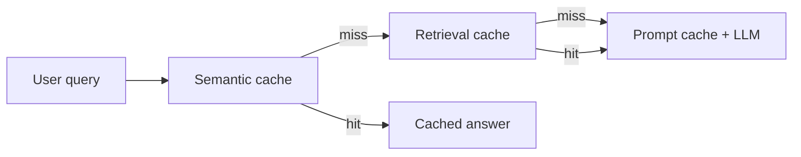

Production **Retrieval-Augmented Generation (RAG)** systems often feel fast in prototypes but become expensive and slow at scale—partly because the same large context windows are rebuilt on every request. A **multi-tier caching strategy** intercepts work at three sequential layers (application, data, inference) to cut latency from seconds to milliseconds and reduce token spend by roughly **30–70%**, depending on traffic patterns and provider pricing.

## Summary

- Treat caching as **three distinct layers**, not a single feature flag: **semantic** → **retrieval & reranking** → **prompt** caching.
- **Semantic caching** (application layer) matches queries by **embedding similarity**, not exact strings, and on a hit can skip both vector search and the LLM—reported latency drops from ~2000 ms to ~10 ms with **zero** embedding or LLM tokens billed.
- **Retrieval & reranking caching** (data layer) stores the **retrieved chunk list** keyed by a normalized question or query embedding, avoiding repeated vector lookups and GPU reranking when many users explore the same topic.
- **Prompt caching** (inference layer) is a **provider-native** feature (OpenAI, Anthropic, DeepSeek, Google Gemini, etc.) that reuses a pre-parsed **prompt prefix** when system instructions plus retrieved documentation stay identical across requests.
- Structure prompts as **`[System Prompt] → [Retrieved Context] → [User Query]`** so the longest shared prefix qualifies for provider cache hits; keep the **unique user query at the bottom**.
- Semantic caches typically use **Redis** or **GPTCache** with a **tight cosine similarity threshold** (often **0.92–0.96**); lower thresholds risk wrong answers for semantically different questions.
- Align **TTL** with data freshness: static FAQs **7–30 days**, product docs **24–48 hours**, dynamic inventory/metrics **cache disabled**.
- For multi-tenant or private data, **never use a global semantic cache**—append **`user_id` or `tenant_id`** to cache keys to prevent cross-account leakage.

## Three caching layers

Requests flow through the layers in order. Each layer only runs when the previous one misses.



### 1. Semantic caching (application layer)

Traditional caches require an **exact string match**. Conversational queries rarely repeat verbatim (“How do I reset my password?” vs “Forgot my password, help.”).

A **semantic cache** embeds the incoming query and matches on **meaning** (vector similarity). On a **miss**, the full RAG pipeline runs and the **final LLM response** is stored in a fast store (e.g. Redis or a dedicated index in the vector database). On a **high-similarity hit**, the system **bypasses vector search and the LLM** and returns the stored answer immediately.

| Metric (per source) | Effect on hit |
| ------------------- | ------------- |
| Latency             | ~2000 ms → ~10 ms |
| Cost                | $0 to embedding/LLM providers |

### 2. Retrieval and reranking caching (data layer)

Novel questions miss the semantic cache, so the pipeline must **fetch and rerank** document chunks—expensive when many users ask different phrasings about the **same underlying topic** (breaking news, company policy rollouts, shared research themes).

This layer caches the **output of the vector database and reranker**:

- **Key:** normalized question text **or** the query embedding.
- **Value:** the raw retrieved chunk array, e.g. `[chunk_1, chunk_2, ...]`.

On a hit, the system skips brute-force vector search and **cross-encoder reranking on GPU**, protecting the data cluster from repetitive load. The LLM may still run unless a higher layer also hits—but retrieval cost is already saved.

### 3. Prompt caching (LLM provider layer)

When a request reaches the model, **prompt caching** is the last cost safeguard. Providers store a **pre-parsed prefix** of the prompt so identical leading context is not recomputed on every API call.

Typical RAG prompt shape:

```
[System Instructions] + [Large retrieved documentation] + [User Query]
```

The **system instructions and retrieved documentation** form the shared **prefix**. If multiple users query against the same knowledge base, that prefix is often identical; only the trailing user query changes—hence the requirement to place the **unique query last**.

Reported provider discounts on cache hits (figures from source; verify current pricing):

| Provider   | Cache behavior (per source) | Input token discount (examples cited) |
| ---------- | --------------------------- | ------------------------------------- |
| OpenAI     | Automatic for prompts **> 1,024 tokens** | ~**50%** on flagship tiers (e.g. GPT-5.4) |
| Anthropic  | Explicit cache controls     | Up to ~**90%** (e.g. Claude Sonnet ~$3.00/MTok → ~$0.30/MTok) |
| DeepSeek   | Provider-native caching     | Up to ~**90%** on input tokens |

## Implementation blueprint

1. **Restructure prompts first** — `[System Prompt] → [Retrieved Context] → [User Query]` maximizes identical prefix length for vendor prompt caches.
2. **Add semantic caching** — gateway with Redis or GPTCache; set similarity threshold in the **0.92–0.96** cosine range unless you accept more false-positive hits.
3. **Define TTL policies** — static FAQs **7–30 days**; product docs/manuals **24–48 hours**; dynamic metrics/inventory **no cache**.
4. **Enforce tenant isolation** — for financial statements, email, or other per-user corpora, scope cache keys with **`user_id` or `tenant_id`**; do not share semantic cache entries globally.

## Layer comparison

| Layer            | Stack position   | Typical backing              | Primary savings                          |
| ---------------- | ---------------- | ---------------------------- | ---------------------------------------- |
| Semantic         | Application      | Redis, GPTCache              | Skips LLM entirely (~100% LLM cost)      |
| Retrieval        | Data pipeline    | Local DB / app cache         | Vector DB + GPU reranker overhead        |
| Prompt           | Inference        | OpenAI, Anthropic, others    | **50–90%** off priced input prefix tokens |

## Related

- [[Harness Engineering]] — RAG and vector stores as long-term memory in agent harnesses.
- [[PII redaction before LLM prompts]] — scrubbing retrieved context before it crosses the model boundary.

## Sources

- [Vaibhav Deodhe — *The 3 Caching Layers Every Production RAG Pipeline Needs*](https://medium.com/@vaibhavkdd/the-3-caching-layers-every-production-rag-pipeline-needs-485cfd946eb6)
