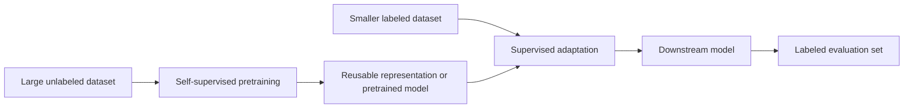

Supervised and self-supervised learning differ mainly in how they obtain the targets used during training. This page compares their training signals, typical workflows, strengths, and limitations for choosing an approach or understanding modern model pretraining.

## Summary

- **Supervised learning** trains on examples paired with externally supplied labels, such as an image and its class or a house and its sale price.
- **Self-supervised learning (SSL)** creates targets from the data itself, avoiding manual labels for the pretraining task.
- SSL is still optimized against a training objective; "self-supervised" describes where the target comes from, not the absence of supervision or loss functions.
- Supervised learning directly optimizes a known downstream task, while SSL usually learns reusable representations through a pretext objective.
- Common SSL objectives include recovering masked content, predicting future content, and matching related views of the same example.
- A frequent workflow is to pretrain on abundant unlabeled data, then adapt the model with labeled data through fine-tuning or a supervised classifier.
- SSL can reduce the amount of labeled data needed, but it may require large datasets, substantial compute, and careful objective or augmentation design.
- The two approaches are complementary rather than mutually exclusive; many modern systems use both.

## Training Signal

### Supervised Learning

A supervised dataset contains **features** and a corresponding **label** for each training example. The model predicts the label, compares its prediction with the known value through a loss function, and updates its parameters to reduce that loss.

Typical tasks include:

- **Classification:** predict a discrete class, such as whether a message is spam.
- **Regression:** predict a continuous value, such as rainfall or a sale price.
- **Structured prediction:** produce labels with internal structure, such as a sequence of tags or a segmentation mask.

Labels can be produced by people, measurements, business processes, or another trusted system. Their usefulness depends on correctness, consistency, coverage, and how closely they represent the deployed task.

### Self-Supervised Learning

Self-supervised learning derives a prediction target automatically from an unlabeled example. A transformation hides, separates, or relates parts or views of the data, allowing the original data to provide the answer.

The initial objective is often a **pretext task** chosen to make the model learn useful representations:

- **Masked prediction:** hide part of an input and reconstruct it. BERT, for example, learns from masked tokens in text.
- **Autoregressive prediction:** predict a future or next element from preceding context.
- **Contrastive or joint-embedding learning:** make representations of related views similar while distinguishing unrelated examples. SimCLR uses augmented views of images.
- **Latent prediction:** predict a representation of hidden or future content rather than reconstructing every raw detail.

The learned encoder or full model is then evaluated or adapted on a **downstream task**. This stage often uses labeled data even though pretraining did not.

## Comparison

| Aspect | Supervised learning | Self-supervised learning |
| --- | --- | --- |
| Target source | External labels or measured outcomes | Targets derived from the input data |
| Primary goal | Learn a specified task directly | Learn reusable structure or representations |
| Data requirement | Labeled examples | Usually large amounts of unlabeled data |
| Typical training stage | Task-specific training | Pretraining before downstream adaptation |
| Labeling cost | Can be high, especially with expert annotation | Lower for pretraining, though downstream evaluation may still need labels |
| Objective alignment | Directly aligned with the labeled task | Depends on whether the pretext objective captures useful downstream information |
| Common evaluation | Held-out labeled examples | Linear probing, fine-tuning, or task-specific evaluation |
| Representative examples | Image classification, spam detection, price prediction | BERT masked-token prediction, SimCLR image pretraining, wav2vec 2.0 speech pretraining |

## How They Work Together

A common pipeline combines both methods:

Two common adaptation strategies are:

- **Linear probing:** freeze the pretrained encoder and train a small supervised classifier on its representations. This tests how directly useful the learned features are.
- **Fine-tuning:** update some or all pretrained parameters using labeled examples from the downstream task.

BERT demonstrated this pattern for language by pretraining on unlabeled text and then fine-tuning with an additional output layer. SimCLR showed that contrastive image pretraining could produce representations competitive with supervised ImageNet training and perform well when only a fraction of labels was available. wav2vec 2.0 applied a related pretrain-then-fine-tune strategy to speech recognition.

## Choosing an Approach

Prefer **supervised learning** when:

- The target is clearly defined and enough representative labels are available.
- Direct task performance matters more than learning a reusable general representation.
- Compute or unlabeled pretraining data is limited.

Consider **self-supervised pretraining** when:

- Unlabeled domain data is abundant but annotation is expensive or scarce.
- The same representation may support several downstream tasks.
- A suitable pretext objective, augmentation strategy, or pretrained model exists for the data type.

Use a **combined approach** when a pretrained representation can reduce labeling needs or improve performance, but the final task still needs explicit alignment with labeled outcomes.

## Limitations

- Automatically generated targets are cheap but not automatically useful; the pretext task can encourage shortcuts or invariances that discard information needed downstream.
- SSL often shifts cost from annotation to data collection, storage, training compute, and experiment design.
- Contrastive methods can be sensitive to augmentation choices, batch composition, and the definition of positive and negative pairs.
- Labeled validation and test sets are generally still needed to measure downstream performance.
- Neither approach removes bias, privacy, provenance, or distribution-shift concerns in the training data. See [[Responsible AI]].

## Related

- [[Masked vs Autoregressive Language Models]] - compares two objectives commonly used in self-supervised language-model pretraining.
- [[Responsible AI]] - covers broader concerns that apply regardless of how training targets are obtained.

## Sources

- [Google for Developers - Supervised Learning](https://developers.google.com/machine-learning/intro-to-ml/supervised)
- [IBM - What Is Self-Supervised Learning?](https://www.ibm.com/think/topics/self-supervised-learning)
- [Devlin et al. - BERT: Pre-training of Deep Bidirectional Transformers for Language Understanding](https://aclanthology.org/N19-1423/)
- [Chen et al. - A Simple Framework for Contrastive Learning of Visual Representations](https://proceedings.mlr.press/v119/chen20j.html)
- [Baevski et al. - wav2vec 2.0: A Framework for Self-Supervised Learning of Speech Representations](https://arxiv.org/abs/2006.11477)
