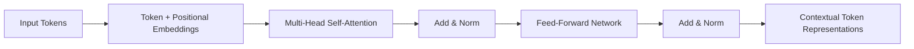
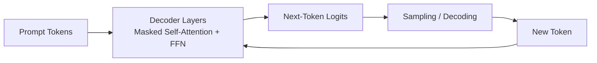

Transformer architecture is a neural-network design introduced in *Attention Is All You Need* (2017) that replaced recurrence with **self-attention** for sequence modeling.

It is the core architecture behind most modern large language models (LLMs) and many multimodal foundation models.

## Why Transformers Matter

- Process tokens in parallel during training, improving efficiency over RNN-based approaches.
- Capture long-range dependencies with attention rather than fixed-size context windows.
- Scale effectively with data, parameters, and compute.
- Provide a flexible backbone for encoder-only, decoder-only, and encoder-decoder models.

## Core Building Blocks

- **Token embedding**: maps discrete tokens to dense vectors.
- **Positional encoding**: injects order information because attention alone is permutation-invariant.
- **Multi-head self-attention**: lets each token attend to relevant tokens across multiple representation subspaces.
- **Feed-forward network (FFN/MLP)**: adds nonlinear transformation per token.
- **Residual connections + layer normalization**: improve optimization stability and gradient flow.

## High-Level Architecture Variants

- **Encoder-only** (for understanding tasks): e.g., BERT-style models.
- **Decoder-only** (for text generation): e.g., GPT-style models.
- **Encoder-decoder** (for transduction): e.g., T5-style or classic translation models.

## Attention Flow (Simplified)

## Decoder-Only Autoregressive Generation

In decoder-only LLMs, masked self-attention enforces causality so each position can attend only to previous tokens.

## Strengths

- Strong transfer learning performance with pretraining + finetuning or instruction tuning.
- General-purpose architecture usable across NLP, vision, speech, and multimodal systems.
- Supports in-context learning behavior in large-scale models.

## Limitations

- Attention cost grows quickly with sequence length (quadratic in standard self-attention).
- Training and serving can be compute- and memory-intensive.
- Sensitive to data quality and alignment choices.
- Can still hallucinate or produce unsafe content without guardrails.

## Related

- [[Model Weights]]
- [[Parameters]]
- [[Hyperparameters]]
- [[Chain of Thought Prompting]]
- [[Inference Optimization]]
- [[Responsible AI]]

## Sources

- [Attention Is All You Need (Vaswani et al., 2017)](https://arxiv.org/abs/1706.03762)
- [The Illustrated Transformer](https://jalammar.github.io/illustrated-transformer/)
