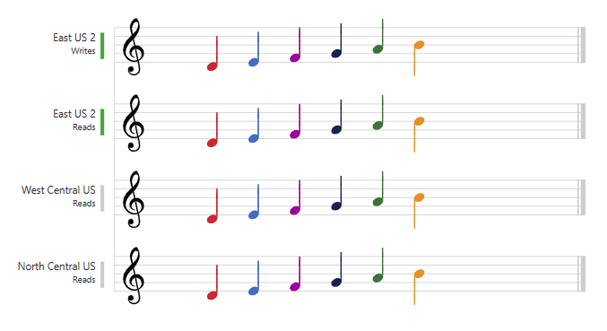
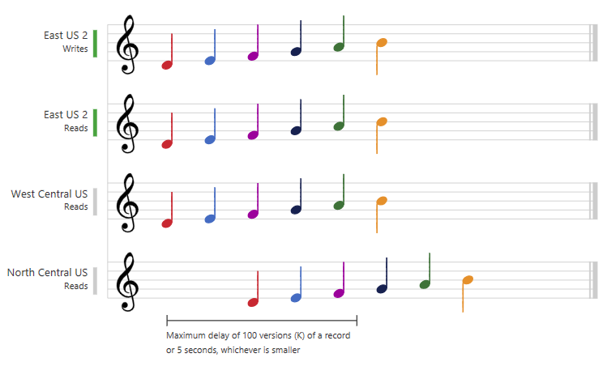
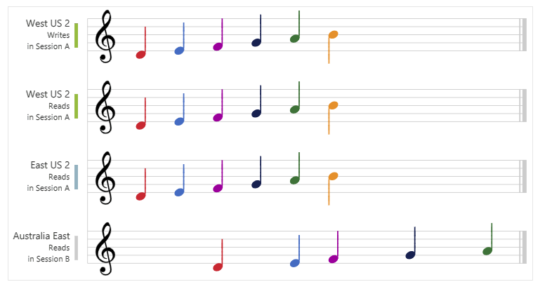
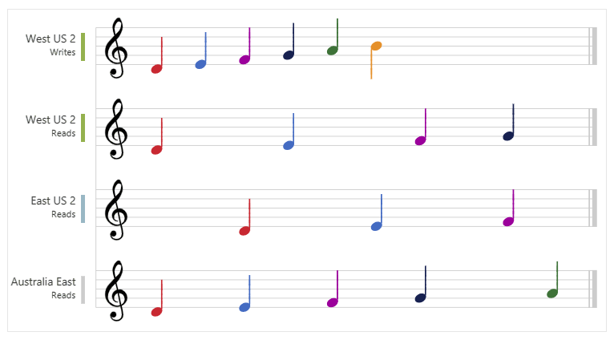
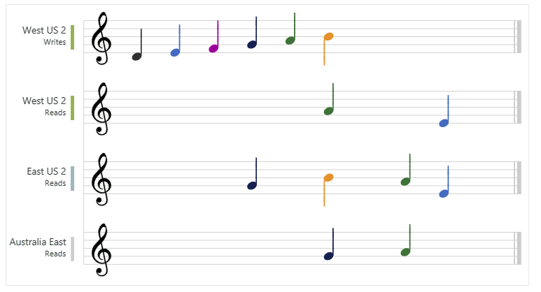

Azure Cosmos DB approaches data consistency as a spectrum of choices instead of two extremes.

[[Strong consistency]] and [[eventual consistency]] are at the ends of the spectrum, but there are many consistency choices along the spectrum.

Developers can use these options to make precise choices and granular tradeoffs with respect to high availability and performance. There are five consistency levels:

1. Strong
2. Bounded staleness
3. Session
4. Consistent prefix
5. Eventual

The weaker is the consistency, the higher are the availability and throughput. Also, #latency becomes lower.

Consistency levels are region-agnostic and guaranteed for all operations. The default consistency level configured on your account applies to all Azure Cosmos DB databases and containers under that account.

Read consistency applies to a single read operation scoped within a partition-key range or a logical partition.

Azure Cosmos DB **guarantees that 100% of read requests meet the consistency guarantee** for the consistency level chosen. The definition of the consistency levels uses the [[TLA+ specification language]].

## Strong Consistency

Strong consistency offers a **linearizability guarantee**.

[[Linearizability]] refers to serving requests concurrently. The reads are guaranteed to return the most recent committed version of an item.

A client never sees an uncommitted or partial write.

Users are always guaranteed to read the latest committed write.

## Bounded staleness consistency

In bounded staleness consistency, the reads are guaranteed to honor the consistent-prefix guarantee.

The reads might lag behind writes by at most "K" versions (that is, "updates") of an item or by "T" time interval, whichever is reached first. In other words, when you choose bounded staleness, the "staleness" can be configured in two ways:

- The number of versions (K) of the item
- The time interval (T) reads might lag behind the writes

For a single region account, the minimum value of K and T is 10 write operations or 5 seconds. For multi-region accounts the minimum value of K and T is 100,000 write operations or 300 seconds.

[[Che succede se ci sono più di 10 write negli ultimi 5 secondi? Si perde la consistency?]]

Bounded staleness consistency is most frequently chosen by globally distributed applications expecting low write latencies but total global order guarantees.

Unlike strong consistency which is scoped to a single region, you can choose bounded staleness consistency with any number of read regions (along with a write region). Bounded staleness is great for applications featuring group collaboration and sharing, stock ticker, publish-subscribe/queueing etc

## Session consistency

In session consistency, **within a single client session** reads are guaranteed to honor the consistent-prefix, [[monotonic reads]], [[monotonic writes]], [[read-your-writes]], and [[write-follows-reads]] guarantees.

This assumes a single "writer" session or sharing the session token for multiple writers.

This is the **default consistency level**.

It provides write latencies, availability and read throughput comparable to that of eventual consistency but also provides the consistency guarantees that suit the needs of applications written to operate in the context of a user.

## Consistent prefix consistency

Updates made as single document writes see eventual consistency.

Updates made as a batch within a transaction, are returned consistent to the transaction in which they were committed.

Write operations within a transaction of multiple documents are always visible together.

Assume two write operations are performed on documents Doc 1 and Doc 2, within transactions T1 and T2. When client does a read in any replica, the user sees either “Doc 1 v1 and Doc 2 v1” or “Doc 1 v2 and Doc 2 v2”, but never “Doc 1 v1 and Doc 2 v2” or “Doc 1 v2 and Doc 2 v1” for the same read or query operation.

If writes were performed in the order `A, B, C`, then a client sees either `A`, `A,B`, or `A,B,C`, but never out of order like `A,C` or `B,A,C`.

Consistent Prefix provides write latencies, availability and read throughput comparable to that of eventual consistency, but also **provides the order guarantees** that suit the needs of scenarios where order is important.

## Eventual consistency

In eventual consistency, there's no ordering guarantee for reads. In the absence of any further writes, the replicas eventually converge.

Eventual consistency is the weakest form of consistency because **a client may read the values that are older than the ones it read before**.

Eventual consistency is ideal where the application doesn't require any ordering guarantees. Examples include count of Retweets, Likes, or nonthreaded comments.

[Wikipedia](https://en.wikipedia.org/wiki/Consistency_model)
[Consistency Levels on Microsoft Learn](https://learn.microsoft.com/en-gb/azure/cosmos-db/consistency-levels)
