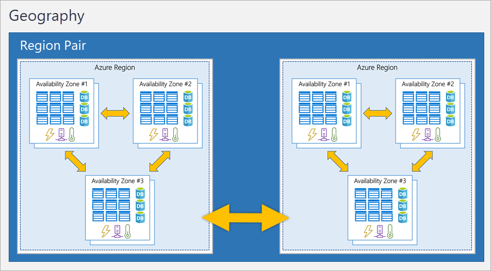

Azure is structured into sub parts.

There is a **physical structure**, in which every datacenter is located in an [[Azure Availability Zones]], each Availability zone is located within an [[Azure Regions]], and Regions are coupled in [[Azure Region Pairs]].

There is a sort of **logical infrastructure** used to manage resources: [[Resource Groups]] are grouped in [[Azure Subscriptions]], which in turn are grouped in [[Management groups]].

