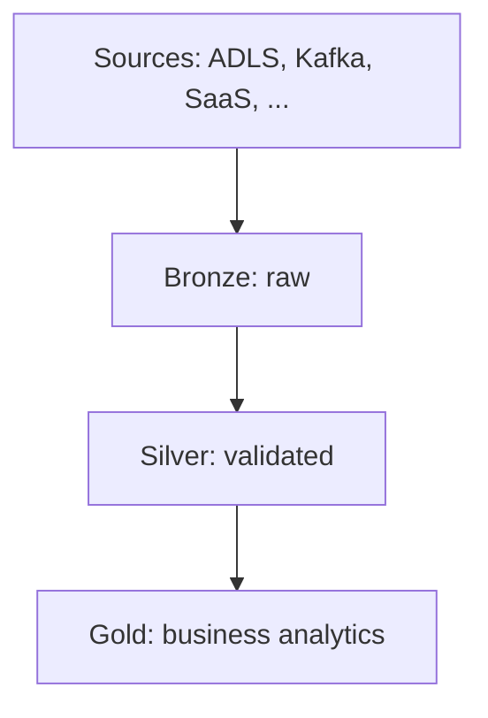

The **medallion architecture** is a data design pattern for organizing tables in a **lakehouse** into quality layers: **Bronze** (raw), **Silver** (validated), and **Gold** (enriched). Data flows Bronze ⇒ Silver ⇒ Gold so structure and quality improve incrementally before analytics and ML consume it. Azure Databricks recommends this pattern for a reliable enterprise data product; it is a best practice, not a strict requirement.

## Summary

- Three layers denote **data quality**: raw ingestion, cleaning/validation, then business-ready modeling and aggregation.
- Also called a **multi-hop architecture** — each hop refines data for the next consumer tier.
- **Bronze** preserves source fidelity (append-only history, reprocessing, audit); minimal validation; not aimed at analysts.
- **Silver** cleanses, deduplicates, enforces schema, joins sources, and keeps at least one **validated, non-aggregated** row-level representation per record.
- **Gold** delivers **semantically meaningful**, often **aggregated** datasets for BI, dashboards, ML features, and executives — dimensional models, measures, and precomputed rollups.
- Build Silver from Bronze (or other Silver tables), not by writing ingestion directly to Silver — avoids schema-change and corrupt-record failures upstream.
- Bronze fields are often stored as `string`, `VARIANT`, or `binary` to survive unexpected schema drift without dropping data.
- Ingestion frequency trades **cost vs latency**: continuous streaming (highest cost, lowest latency) through triggered incremental to batch/manual incremental (lowest cost, highest latency).

## Details

### Layer flow

| Layer      | Primary work                                                | Typical consumers                                             |
| ---------- | ----------------------------------------------------------- | ------------------------------------------------------------- |
| **Bronze** | Raw ingestion; preserve original formats                    | Data engineers, data operations, compliance/audit             |
| **Silver** | Cleaning, validation, deduplication, joins, type casting    | Data engineers, analysts (detailed analysis), data scientists |
| **Gold**   | Dimensional modeling, aggregation, domain-specific datasets | BI developers, business analysts, ML engineers, executives    |
![[Pasted image 20260706180759.png]]
### Bronze layer

Bronze tables hold **raw, unvalidated** data:

- Maintain the **raw state** of each source in original formats.
- Grow **incrementally** over time (append).
- Act as the **single source of truth** for fidelity, reprocessing, and audit — retain full history.
- Accept **streaming and batch** from object storage (S3, GCS, ADLS), message buses (Kafka, Kinesis), and federated sources.

**Minimal cleanup at ingest.** Azure Databricks recommends storing most columns as `string`, `VARIANT`, or `binary` so unexpected schema changes do not cause data loss during type coercion. Optional metadata columns (for example `_metadata.file_name`) record provenance.

Bronze is for pipelines that **feed Silver**, not for direct analyst or data-scientist access.

### Silver layer

Silver is where **data quality work** happens:

- Schema enforcement and evolution
- Null handling, deduplication, normalization
- Late-arriving and out-of-order event resolution
- Quality checks, type casting, joins across sources
- Early **data modeling** choices for nested/semi-structured data (`VARIANT`, JSON strings, structs, flattening)

Read from one or more **Bronze or Silver** tables; write to Silver. For append-only sources, prefer **streaming reads** from Bronze; reserve batch reads for small dimensions.

**Silver vs Gold — aggregation boundary.** Silver should include at least one **validated, non-aggregated** representation of each logical record. Cleansing, enrichment, and joins belong here. **Heavy aggregation** (weekly sales rollups, executive KPI summaries) usually belongs in **Gold**, though Silver may hold aggregate tables when many downstream jobs need them and the source article allows that exception.

Do **not** ingest directly into Silver: schema changes and bad records from sources will surface as pipeline failures instead of being isolated in Bronze.

### Gold layer

Gold holds **highly refined** views for downstream analytics, dashboards, ML, and applications:

- **Aggregated** and often filtered by time, region, or business unit
- **Aligned to business logic** — dimensional models with relationships and measures
- **Optimized for query performance** on frequently accessed dashboards

Organizations may maintain **multiple Gold zones** (HR, finance, IT) when domains differ. Historical detail at row granularity typically stays in **Silver**; Gold materializes what reporting needs, not full history.

Example Gold outputs from a sales ops catalog: `customer_spending`, `account_performance`, `sales_pipeline_summary`, `business_summary`.

### Ingestion frequency and cost

| Pattern | Cost | Latency | Idea |
| --- | --- | --- | --- |
| Continuous incremental | Higher | Lower | Streaming tables / `spark.readStream`, continuous jobs |
| Triggered incremental | Lower | Higher | Scheduled or file-arrival triggers, `Trigger.Available` |
| Batch with manual incremental | Lowest | Highest | `spark.read` with partition overwrite; needs upstream partition design |

## Related

- [[Apache Spark]] — execution engine behind Databricks Structured Streaming and lakehouse pipelines
- [[Open Data Contracts]] — complementary pattern for typed expectations across data products
- [[Azure Blob Storage]] — common Bronze source when using ADLS-backed object storage on Azure

## Sources

- [What is the medallion lakehouse architecture? — Azure Databricks (Microsoft Learn)](https://learn.microsoft.com/en-us/azure/databricks/lakehouse/medallion)
