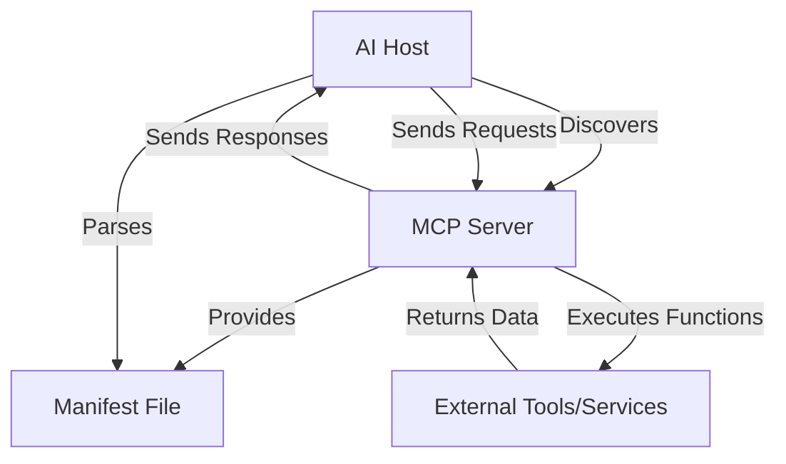

---
tags:
  - AI
  - artificial-intelligence
  - protocol
  - communication
aliases:
  - MCP
---
The Model Context Protocol (MCP) is an open standard introduced by Anthropic in 2024 to streamline how AI systems interact with external tools, data sources, and services.

It simplifies integration by replacing bespoke APIs with a unified, schema-driven protocol.

MCP enables AI models to **dynamically discover, invoke, and collaborate with external resources** via a lightweight, JSON-based architecture.

## Key Components of MCP

- **MCP Host**
  - The AI system (e.g., #Claude, #OpenAI) that interacts with external tools.
  - Responsibilities include discovering tools, interpreting manifests, constructing valid requests, and handling responses. It also manages authentication and error handling.
- **MCP Server**
  - A service that exposes callable functions through MCP's structured manifest.
  - It validates requests, executes functions, and returns structured responses while maintaining internal implementation details.
- **Manifest File**
  - A JSON document that defines the server's available functions, input parameters, output types, and constraints.
  - It acts as a contract, allowing hosts to dynamically understand and interact with tools without hardcoding.

## Types of MCP Manifests

**Static Manifests**: Define a fixed set of functions, ensuring stability for core tools.

**Dynamic Manifests**: Adapt capabilities based on context, such as user permissions or system states, enabling tools to evolve dynamically.

## MCP Workflow

1. The host detects available MCP servers and fetches their manifests.
2. The manifest is parsed to understand available functions.
3. The host constructs requests based on the manifest's schema.
4. The server executes the function and returns a response.
5. The host processes the response for further reasoning or action.

## Key Challenges

### Security Risks

- Poorly scoped MCP servers may inadvertently **expose sensitive operations or data**.
- Strict authentication, manifest validation, and permission controls are crucial to mitigate risks.
- Dynamic tool discovery introduces potential vulnerabilities, such as **privilege escalation**, if manifests are not properly secured.

### Tool Discoverability

- Dynamic environments can lead to unintentionally exposed endpoints or metadata leakage.
- Manifest files themselves may reveal sensitive internal information.
- Managing and maintaining an accurate inventory of available tools becomes increasingly challenging as the ecosystem grows.

### Error Handling Complexity

- **Variability in error structures** across different servers complicates recovery and fallback mechanisms for AI hosts.
- Cascading failures are more likely as error conditions propagate unpredictably through interconnected tool chains.
- Multi-agent systems exacerbate these issues when multiple AI hosts interact with the same tools simultaneously but have differing error-handling capabilities.

## Implementation Highlights

- Ease of Integration: Developers can create MCP-compatible tools using any backend that supports HTTP and JSON. This flexibility allows integration across various platforms and languages.
- Manifest Generators: Tools are available to automate the creation of manifest files. These generators analyze codebases, APIs, and data models to produce comprehensive manifests with minimal manual effort. They can also infer constraints, identify required fields, and update manifests as code evolves.
- Middleware Wrappers: Libraries exist to simplify exposing existing functions as MCP endpoints. These wrappers support multiple programming languages like Python, Node.js, Bash, and Go, handling server configuration, request parsing, and validation.

## Ecosystem Development

- Open-Source Resources: The MCP ecosystem includes a growing library of open-source tools and middleware that developers can leverage to accelerate adoption.
- CI/CD Integration: Manifest generators and other tools can be integrated into CI/CD pipelines to ensure that endpoints remain synchronized with underlying codebases as they evolve.
- Community Contributions: The open nature of MCP encourages developers to contribute new integrations, expanding the ecosystem and making MCP more versatile.

## Mermaid Diagram: MCP Architecture

## Links

- [The Model Context Protocol Explained](https://medium.com/@zbabar/the-model-context-protocol-explained-5f35223e4d56)
