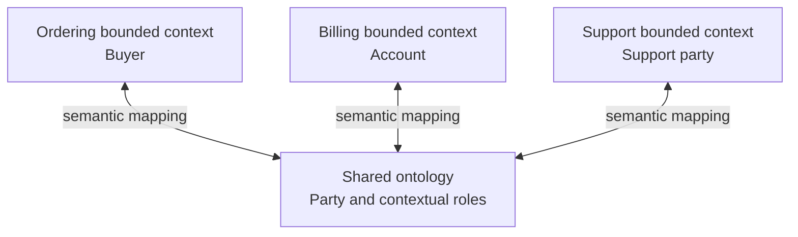

Ontologies and Domain-Driven Design (DDD) both make domain concepts and relationships explicit, but they optimize for different outcomes. DDD shapes software behavior within bounded contexts; an ontology formalizes shared knowledge so that people and machines can exchange, query, and sometimes reason over it.

## Summary

- Both approaches depend on sustained collaboration with domain experts and careful definition of terms.
- A DDD domain model is purpose-specific and bounded; an ontology often aims for broader semantic interoperability and reuse.
- Ubiquitous language supplies terms that may become ontology concepts, while ontology analysis can expose synonyms, hidden assumptions, and missing relationships in a DDD model.
- A bounded context intentionally permits different meanings for the same term; an ontology should not erase those differences without explicit mappings.
- DDD tactical patterns encode behavior, state transitions, transaction boundaries, and invariants in executable software.
- OWL ontologies encode classes, properties, individuals, and logical axioms with formally defined semantics.
- Ontology reasoning and aggregate validation solve different problems: inferred knowledge does not replace transactional enforcement.
- A practical integration keeps each bounded context autonomous and uses an ontology as a semantic bridge at integration, search, analytics, or knowledge-graph boundaries.

## Shared foundation

Both disciplines treat language as part of the model rather than as informal documentation:

- Domain experts help define concepts and acceptable distinctions.
- Terms are connected through relationships rather than maintained as isolated definitions.
- Models evolve when examples contradict current assumptions.
- Explicit semantics reduce accidental ambiguity between teams and systems.

This shared foundation makes ontology work useful during strategic DDD discovery, especially when several bounded contexts or external data standards must interoperate.

## Different purposes

| Dimension | Domain-Driven Design | Ontology engineering |
|---|---|---|
| Primary goal | Build software that expresses and protects domain behavior | Represent shared knowledge with explicit, machine-processable meaning |
| Scope | Deliberately local to a bounded context | Often spans systems, organizations, or datasets |
| Main artifacts | Context maps, domain models, aggregates, value objects, domain events | Classes, properties, individuals, axioms, mappings |
| Semantics | Expressed through language, code, tests, and team conventions | Formally defined by an ontology language such as OWL |
| Rules | Operational invariants and allowed state transitions | Logical statements used for classification, consistency checking, and inference |
| Runtime role | Executes business operations and controls transactions | Supports knowledge integration, querying, classification, and reasoning |
| Change ownership | The team that owns the bounded context | A wider governance group or community may own shared terms |

The closest concepts are related, not equivalent. An ontology class is not automatically a DDD entity, and an OWL property is not simply a C# property. Whether something is an entity, value object, or aggregate depends on behavior, identity, and consistency needs inside a particular context.

## Bounded contexts prevent false unification

Suppose **Customer** has three legitimate meanings:

| Context | Local meaning |
|---|---|
| Ordering | A buyer who places and receives orders |
| Billing | An account responsible for invoices and payment terms |
| Support | A party entitled to request assistance |

DDD preserves these models because each serves different behavior. A shared ontology can describe how `OrderingBuyer`, `BillingAccount`, and `SupportParty` relate to a broader concept, but it should retain provenance and context rather than collapse all three into one object with every possible field.

The ontology acts as a translation layer. Each bounded context remains the authority for its own rules and lifecycle.

## How they can reinforce each other

### From DDD to an ontology

1. Use domain discovery and ubiquitous-language conversations to identify candidate terms.
2. Record which bounded context owns each meaning.
3. Promote only concepts that need cross-context discovery or exchange.
4. Define explicit mappings from local terms to shared ontology concepts.
5. Review mappings when either the local model or shared ontology changes.

Domain events can also provide semantically meaningful facts for a knowledge graph. For example, an `OrderSubmitted` event may create or update relationships among a buyer, an order, products, and a fulfillment location.

### From an ontology to DDD

An existing ontology can accelerate discovery by providing:

- agreed definitions and synonyms;
- taxonomies and type relationships;
- cross-system identifiers and mappings;
- constraints or logical implications worth discussing with experts.

These inputs are evidence, not an implementation blueprint. The team still decides which concepts have identity, which behaviors belong together, and where aggregate and context boundaries should be drawn.

## Keep operational and semantic rules separate

Consider the statement, "Every submitted order has at least one line."

- In DDD, `Order.Submit()` rejects an empty order immediately and preserves a transactional invariant.
- In an ontology, a logical axiom can describe the relationship and allow a reasoner to classify or infer facts under that ontology's semantics.

These mechanisms are not interchangeable. OWL uses open-world reasoning: missing information is generally not assumed to be false. Application code, by contrast, must make an operational decision using the state available during a command. Keep aggregate validation in the domain model even when the same concepts also appear in an ontology.

## When combining them is useful

- Several bounded contexts exchange semantically rich data.
- A knowledge graph supports search, analytics, or AI across operational systems.
- The organization must align local models with an industry vocabulary.
- Terms and identifiers must remain traceable across independently owned systems.
- Automated classification or inference adds value beyond application transactions.

For a single application with limited integration and straightforward rules, a ubiquitous language and bounded-context model may be sufficient. Introducing an ontology adds modeling, tooling, mapping, versioning, and governance costs.

## Related

- [[Domain-Driven Design]]
- [[Ontologies in AI]]
- [[Event-Driven Architecture]]
- [[Event Sourcing]]

## Sources

- [Eric Evans — Domain-Driven Design Reference](https://www.domainlanguage.com/ddd/reference/)
- [Martin Fowler — Ubiquitous Language](https://martinfowler.com/bliki/UbiquitousLanguage.html)
- [Martin Fowler — Bounded Context](https://martinfowler.com/bliki/BoundedContext.html)
- [Microsoft Learn — Designing a Microservice Domain Model](https://learn.microsoft.com/en-us/dotnet/architecture/microservices/microservice-ddd-cqrs-patterns/microservice-domain-model)
- [W3C — OWL 2 Web Ontology Language Document Overview](https://www.w3.org/TR/owl2-overview/)
- [W3C — OWL 2 Web Ontology Language Primer](https://www.w3.org/TR/owl2-primer/)
