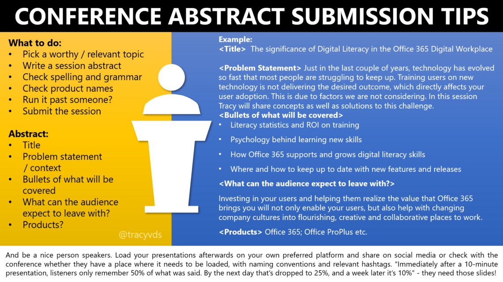

1. Explain why people should follow your session
2. Explain why you are the best person to talk about it;
3. Use **bullet points** to list the topics covered by this session. List them in the order they will occur;
4. Tell what audience will learn from this session;
5. **Do not use your name** to avoid bias.
6. Tell if you are going to share slides/repo with the audience;

Remember that Talks are like Stories: they should have a starting and an end point.

[Writing a Great Session Abstract | Zoe](https://zoe-365.com/writing-a-great-session-abstract/)
