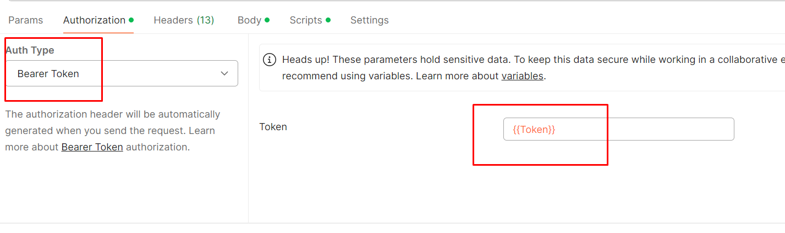

---
tags:
  - postman
  - authentication
  - token
  - bearer-token
---

In the Prerequest Scripts section of a Postman collection, use this script to generate a [[bearer-token]] and store it in a variable named `Token`.

You have to define TokenUrl, ClientId and ClientSecret in the environment variables.

```js
const tokenUrl = pm.variables.get("TokenUrl");
const clientId = pm.variables.get("ClientID");
const clientSecret = pm.variables.get("ClientSecret");

const getTokenRequest = {
    method: 'POST',
    url: tokenUrl,
    body: {
        mode: 'formdata',
        formdata: [
            { key: 'grant_type', value: 'client_credentials' },
            { key: 'client_id', value: clientId },
            { key: 'client_secret', value: clientSecret }
        ]
    }
};

pm.sendRequest(getTokenRequest, (err, response) => {
    const jsonResponse = response.json();
    const newAccessToken = jsonResponse.access_token;
    pm.variables.set('Token', newAccessToken);
});
```

Then you can just reference the token as `{{Token}}`:


