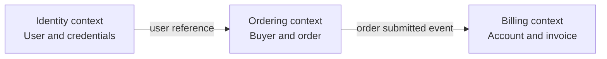

Domain-Driven Design (DDD) is an approach for building software around a deep, continuously refined model of a business domain. It is most useful when business rules are complex enough that collaboration and precise language matter more than simple data entry and CRUD operations.

## Summary

- DDD starts with domain knowledge and collaboration, not with databases, frameworks, or service boundaries.
- A **ubiquitous language** gives domain experts and developers one model-based vocabulary for conversation, documentation, tests, and code.
- A **bounded context** defines where a model and its language are internally consistent; the same word can have a different model in another context.
- Strategic design identifies subdomains, bounded contexts, and the relationships between those contexts.
- Tactical design uses entities, value objects, aggregates, domain services, repositories, and domain events to express a model in code.
- Entities are distinguished by identity; value objects are distinguished by their values and should usually be immutable.
- An aggregate is a transactional consistency boundary whose root protects invariants.
- DDD does not require microservices, CQRS, or event sourcing, although these patterns are often combined.
- Rich domain modeling should be applied selectively: a straightforward CRUD subsystem may not justify its added complexity.

## Strategic design

### Domain and subdomains

The **domain** is the area of knowledge and activity that the software supports. Breaking it into subdomains helps direct design effort:

| Subdomain type | Meaning | Typical treatment |
|---|---|---|
| **Core** | Creates the most business differentiation | Invest in a tailored model and close domain-expert collaboration |
| **Supporting** | Necessary and business-specific, but not differentiating | Build pragmatically |
| **Generic** | Solves a common problem such as authentication or payments | Prefer an established product or service where suitable |

These categories guide investment; they do not prescribe deployment topology.

### Ubiquitous language

A ubiquitous language is the shared language used by domain experts and developers within a bounded context. Terms should appear consistently in conversations, examples, acceptance criteria, class names, and methods.

For an ordering context, `Order.Submit()` communicates a domain transition more precisely than `OrderService.UpdateStatus(order, 2)`. If experts say that an order is *submitted*, that verb belongs in the model.

The language is not a glossary written once. Ambiguous or awkward terms reveal gaps in the model, so both language and model evolve as the team learns.

### Bounded contexts

A bounded context gives a model an explicit boundary. For example, **Customer** can mean:

- a buyer with delivery preferences in **Ordering**;
- an account with invoices and credit terms in **Billing**;
- a person and authentication credentials in **Identity**.

Trying to force these meanings into one enterprise-wide `Customer` class usually creates coupling and ambiguity. Each context owns its model and translates at its boundary.



A **context map** records these boundaries and integration relationships. A bounded context is a semantic and ownership boundary; it may be implemented as a module, a service, or several deployable components.

## Tactical design

| Building block | Purpose | Example |
|---|---|---|
| **Entity** | Maintains identity and continuity as attributes change | `Order`, identified by `OrderId` |
| **Value object** | Describes a value without domain identity | `Money`, `Address`, `DateRange` |
| **Aggregate** | Groups objects that must remain consistent in one transaction | `Order` with its order lines |
| **Aggregate root** | Controls all changes inside an aggregate | Call `Order.AddProduct()`, not a line setter |
| **Domain service** | Holds domain behavior that does not naturally belong to one entity or value object | A pricing policy spanning several inputs |
| **Repository** | Provides a collection-like abstraction for retrieving and saving aggregate roots | `IOrderRepository` |
| **Domain event** | Records a meaningful fact that occurred in the domain | `OrderSubmitted` |

### C# example: an order aggregate

The following example keeps state changes behind domain methods. `Money` uses value equality, while `Order` has identity and protects the rules of its aggregate.

```csharp
public readonly record struct OrderId(Guid Value);
public readonly record struct ProductId(Guid Value);

public sealed record Money
{
    public decimal Amount { get; }
    public string Currency { get; }

    private Money(decimal amount, string currency)
    {
        Amount = amount;
        Currency = currency;
    }

    public static Money Of(decimal amount, string currency)
    {
        if (amount < 0)
            throw new ArgumentOutOfRangeException(nameof(amount));
        if (string.IsNullOrWhiteSpace(currency))
            throw new ArgumentException("Currency is required.", nameof(currency));

        return new Money(amount, currency.ToUpperInvariant());
    }
}

public sealed record OrderLine(
    ProductId ProductId,
    int Quantity,
    Money UnitPrice);

public enum OrderStatus
{
    Draft,
    Submitted
}

public sealed class Order
{
    private readonly List<OrderLine> _lines = [];
    private readonly string _currency;

    public OrderId Id { get; }
    public OrderStatus Status { get; private set; } = OrderStatus.Draft;
    public IReadOnlyCollection<OrderLine> Lines => _lines.AsReadOnly();

    public Order(OrderId id, string currency)
    {
        if (string.IsNullOrWhiteSpace(currency))
            throw new ArgumentException("Currency is required.", nameof(currency));

        Id = id;
        _currency = currency.ToUpperInvariant();
    }

    public void AddProduct(ProductId productId, int quantity, Money unitPrice)
    {
        if (Status != OrderStatus.Draft)
            throw new InvalidOperationException("A submitted order cannot change.");
        if (quantity <= 0)
            throw new ArgumentOutOfRangeException(nameof(quantity));
        if (unitPrice.Currency != _currency)
            throw new InvalidOperationException("All lines must use the order currency.");

        _lines.Add(new OrderLine(productId, quantity, unitPrice));
    }

    public void Submit()
    {
        if (_lines.Count == 0)
            throw new InvalidOperationException("An empty order cannot be submitted.");

        Status = OrderStatus.Submitted;
    }

    public Money Total() =>
        Money.Of(
            _lines.Sum(line => line.UnitPrice.Amount * line.Quantity),
            _currency);
}
```

The aggregate enforces its invariants at every state transition:

- quantities are positive;
- line currencies match the order currency;
- submitted orders cannot be edited;
- empty orders cannot be submitted.

Application-layer validation can improve error messages, but it should not be the only protection for domain invariants.

### Repository boundary

Repositories normally work with aggregate roots rather than exposing persistence for every table or child entity:

```csharp
public interface IOrderRepository
{
    Task<Order?> GetAsync(OrderId id, CancellationToken cancellationToken);
    Task AddAsync(Order order, CancellationToken cancellationToken);
}
```

The interface belongs near the domain model; database-specific implementations belong in infrastructure. Transactional changes still pass through the aggregate root so that persistence cannot bypass its rules.

## What DDD is not

- **Not a synonym for microservices:** a modular monolith can have well-defined bounded contexts, and one bounded context does not always equal one microservice.
- **Not a mandatory pattern set:** use the strategic and tactical tools that address actual complexity.
- **Not database-first modeling:** persistence schemas support the model rather than define business meaning.
- **Not only class diagrams:** the language, collaboration process, examples, and boundaries are as important as the code.
- **Not justified everywhere:** simple CRUD and generic capabilities often benefit from simpler designs.

## Related

- [[Ontologies and Domain-Driven Design]]
- [[Event-Driven Architecture]]
- [[Event Sourcing]]
- [[Software Architecture vs Software Design]]

## Sources

- [Eric Evans — Domain-Driven Design Reference](https://www.domainlanguage.com/ddd/reference/)
- [Martin Fowler — Ubiquitous Language](https://martinfowler.com/bliki/UbiquitousLanguage.html)
- [Martin Fowler — Bounded Context](https://martinfowler.com/bliki/BoundedContext.html)
- [Microsoft Learn — Tackling Business Complexity in a Microservice with DDD and CQRS Patterns](https://learn.microsoft.com/en-us/dotnet/architecture/microservices/microservice-ddd-cqrs-patterns/)
- [Microsoft Learn — Designing a Microservice Domain Model](https://learn.microsoft.com/en-us/dotnet/architecture/microservices/microservice-ddd-cqrs-patterns/microservice-domain-model)
- [Microsoft Learn — Implementing Value Objects](https://learn.microsoft.com/en-us/dotnet/architecture/microservices/microservice-ddd-cqrs-patterns/implement-value-objects)
- [Microsoft Learn — Designing Validations in the Domain Model Layer](https://learn.microsoft.com/en-us/dotnet/architecture/microservices/microservice-ddd-cqrs-patterns/domain-model-layer-validations)
- [Microsoft Learn — Designing the Infrastructure Persistence Layer](https://learn.microsoft.com/en-us/dotnet/architecture/microservices/microservice-ddd-cqrs-patterns/infrastructure-persistence-layer-design)
